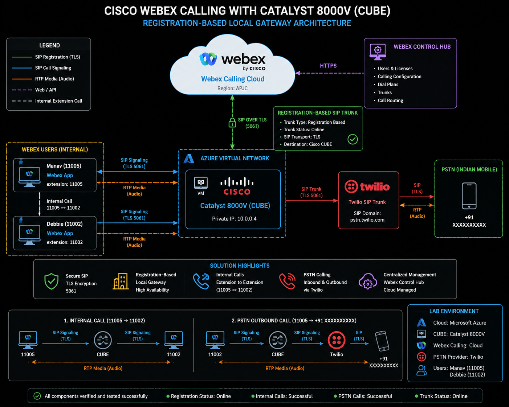
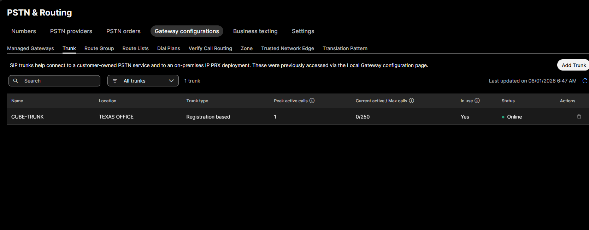
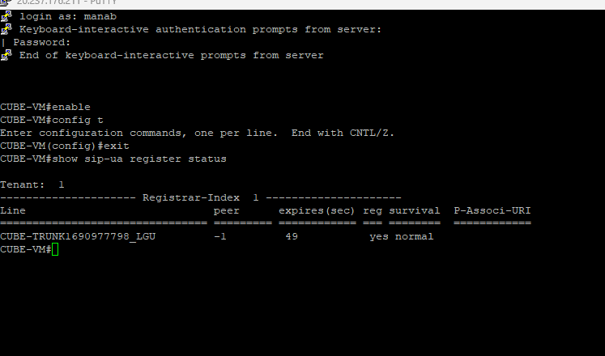
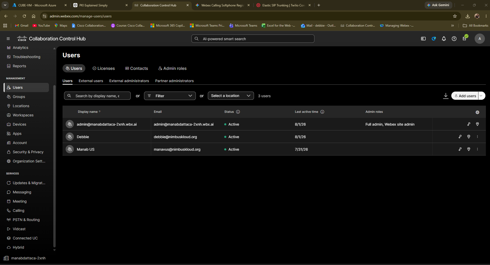
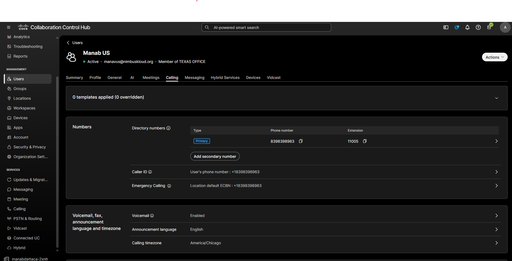
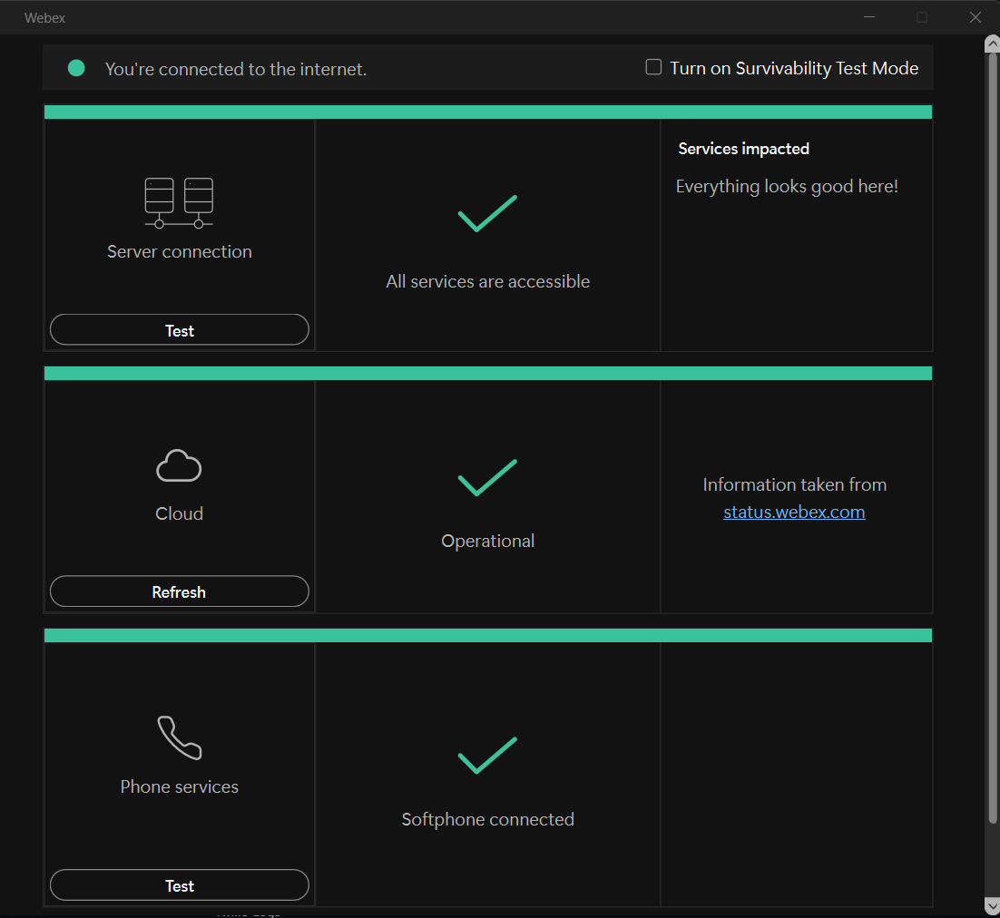
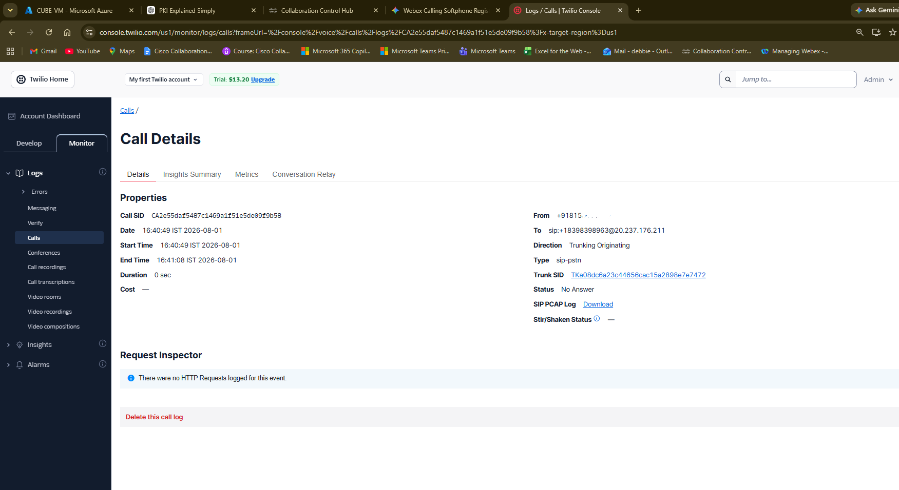

# Cisco Webex Calling + CUBE Registration-Based Local Gateway Lab


---

## Table of Contents

- Project Overview
- Lab Objectives
- Lab Architecture
- Technology Stack
- Deployment Workflow
- Repository Structure
- Configuration Files
- Documentation
- Screenshots
- Verification
- Troubleshooting
- Lessons Learned

---


## Project Overview

This project demonstrates a complete end-to-end deployment of Cisco Webex Calling using Cisco Catalyst 8000V (CUBE) configured as a Registration-Based Local Gateway.

The lab was built from scratch in Microsoft Azure and integrated with Cisco Webex Control Hub and Twilio PSTN to validate both internal extension calling and external PSTN connectivity.

---

## Lab Objectives

- Deploy Cisco Catalyst 8000V (CUBE)
- Configure Registration-Based Local Gateway
- Register CUBE with Cisco Webex Calling
- Configure SIP Trunk
- Configure Dial Peers
- Configure Voice Service VoIP
- Integrate Twilio Elastic SIP Trunk
- Enable PSTN Calling
- Verify SIP Registration
- Validate Internal Calls
- Validate PSTN Calls
- Troubleshoot SIP Registration and Calling Issues

- ---

# Lab Architecture

The following diagram illustrates the complete call flow between Cisco Webex Calling, Cisco CUBE (Catalyst 8000V), and Twilio PSTN.

> *(Architecture diagram will be displayed below once uploaded to the diagrams folder.)*

<p align="center">

</p>


---

# Technology Stack

| Component | Technology |
|-----------|------------|
| Cloud Platform | Microsoft Azure |
| Voice Gateway | Cisco Catalyst 8000V (CUBE) |
| UC Platform | Cisco Webex Calling |
| Administration | Cisco Control Hub |
| PSTN Provider | Twilio Elastic SIP Trunk |
| SIP Registration | Registration-Based Local Gateway |
| Signaling | SIP over TLS |
| Media | RTP/SRTP |
| Security | TLS Certificates |
| Verification | CLI + Control Hub + Twilio Logs |

---

# Key Features

- Registration-Based Local Gateway (Cisco CUBE)
- Cisco Webex Calling Integration
- Twilio Elastic SIP Trunk Integration
- Internal Extension Calling
- PSTN Calling
- SIP over TLS
- Secure RTP (SRTP)
- Dial Peer Configuration
- Voice Service VoIP Configuration
- SIP Registration Verification
- End-to-End Call Validation
- CLI Verification Commands
- Control Hub Administration
- Troubleshooting and Issue Resolution

## Repository Structure

```text
cisco-webex-calling-cube-lab/
│
├── README.md
├── LICENSE
│
├── diagrams/
│   └── Architecture Diagram
│
├── screenshots/
│   ├── 00-architecture-diagram.png
│   ├── 01-control-hub-trunk-online.png
│   ├── 02-cube-sip-registration.png
│   ├── 03-users-and-extensions.png
│   ├── 04-webex-calling-license.png
│   ├── 05-webex-softphone-connected.png
│   ├── 06-internal-call-success.png
│   └── 07-pstn-call-success.png
│
configurations/
│
├── 01-voice-service-voip.md
├── 02-sip-ua.md
├── 03-dial-peers.md
├── 04-webex-registration.md
├── 05-twilio-sip-trunk.md
├── 06-security-and-tls.md
├── 07-tenant-configuration.md
└── 08-global-configuration.md
│
└── docs/
    ├── 01-deployment-guide.md
    ├── 02-call-flow.md
    ├── 03-troubleshooting.md
    └── 04-lessons-learned.md
```
## Skills Demonstrated

- Cisco Webex Calling Administration
- Cisco Catalyst 8000V (CUBE) Configuration
- Registration-Based Local Gateway (RBLG)
- SIP over TLS Configuration
- Twilio Elastic SIP Trunk Integration
- Voice Service VoIP Configuration
- SIP UA Configuration
- Dial Peer Configuration
- Cisco Control Hub Administration
- Internal Extension Calling
- PSTN Call Routing
- TLS and SRTP Security
- SIP Registration Verification
- CLI Troubleshooting
- End-to-End Voice Validation

  ---

## Configuration Files

| File | Description |
|------|-------------|
| [`01-voice-service-voip.md`](configurations/01-voice-service-voip.md) | Voice Service VoIP configuration and global voice settings |
| [`02-sip-ua.md`](configurations/02-sip-ua.md) | SIP UA registration, authentication, and registrar configuration |
| [`03-dial-peers.md`](configurations/03-dial-peers.md) | Incoming and outgoing dial-peer configuration |
| [`04-webex-registration.md`](configurations/04-webex-registration.md) | Registration-Based Local Gateway (RBLG) configuration |
| [`05-twilio-sip-trunk.md`](configurations/05-twilio-sip-trunk.md) | Twilio Elastic SIP Trunk integration |
| [`06-security-and-tls.md`](configurations/06-security-and-tls.md) | TLS certificates, trustpoints, and secure SIP configuration |

---

## Documentation

| Document | Description |
|----------|-------------|
| [`01-deployment-guide.md`](docs/01-deployment-guide.md) | Complete deployment procedure from Azure VM creation to successful call validation |
| [`02-call-flow.md`](docs/02-call-flow.md) | End-to-end SIP call flow between Webex Calling, CUBE, Twilio, and PSTN |
| [`03-troubleshooting.md`](docs/03-troubleshooting.md) | Common issues encountered and the troubleshooting steps used to resolve them |
| [`04-lessons-learned.md`](docs/04-lessons-learned.md) | Key learnings, best practices, and observations from the lab |


---

# Screenshots

## Lab Architecture



---

## Cisco Control Hub - Trunk Status



---

## Cisco CUBE Registration



---

## Users and Extensions



---

## Webex Calling License



---

## Webex Softphone Connected



---

## Internal Extension Call


---


---

# Verification

The following validation steps were completed successfully during the implementation.

| Test | Status |
|------|:------:|
| Cisco CUBE Registration | ✅ |
| Webex Calling Registration | ✅ |
| Cisco Control Hub Trunk Online | ✅ |
| SIP over TLS | ✅ |
| Internal Extension Calling | ✅ |
| PSTN Outbound Calling | ✅ |
| Twilio SIP Trunk Connectivity | ✅ |
| Webex Softphone Registration | ✅ |

## Verification Commands

```cisco
show sip-ua register status

show dial-peer voice summary

show voice class tenant

show running-config | section voice service voip

show call active voice brief
```

## PSTN Call Success




---

# Project Outcomes

This project successfully demonstrated the end-to-end deployment of Cisco Webex Calling using Cisco Catalyst 8000V (CUBE) as a Registration-Based Local Gateway (RBLG) integrated with Twilio Elastic SIP Trunk.

## Successfully Implemented

- ✅ Cisco Webex Calling deployment
- ✅ Registration-Based Local Gateway (RBLG)
- ✅ Cisco Catalyst 8000V (CUBE)
- ✅ SIP over TLS
- ✅ Secure RTP (SRTP)
- ✅ Cisco Control Hub configuration
- ✅ Twilio Elastic SIP Trunk integration
- ✅ Internal extension calling
- ✅ PSTN outbound calling
- ✅ End-to-end call verification
- ✅ Troubleshooting and validation

---

## Skills Demonstrated

- Cisco Collaboration
- Cisco CUBE Administration
- Webex Calling Administration
- SIP Protocol
- SIP over TLS
- Dial Peer Configuration
- SIP UA Configuration
- Voice Service VoIP
- Twilio SIP Trunk
- Troubleshooting
- Microsoft Azure
- Technical Documentation

---

# Future Enhancements

Future improvements for this project include:

- Inbound PSTN calling
- High Availability (HA) deployment
- Multiple SIP Trunks
- Cisco Unified CM integration
- SIPREC call recording
- Redundant CUBE deployment
- Automated configuration backups
- Monitoring using ThousandEyes
- Integration with Microsoft Teams Direct Routing

---

## Author

**Manav Dutta**

Network Engineer | Cisco Collaboration | Microsoft Azure | Cisco Webex Calling

If you found this repository useful, feel free to ⭐ the project.


